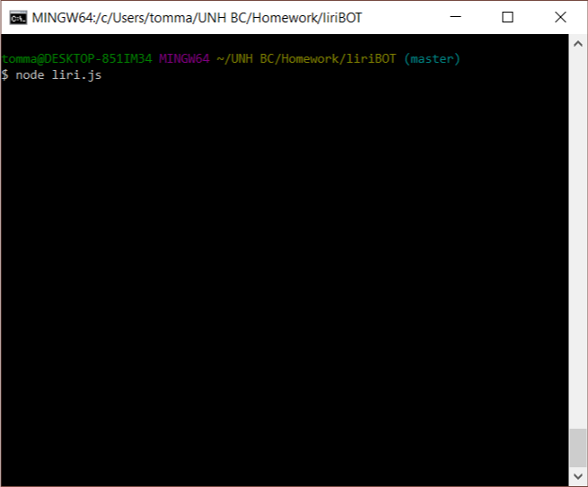
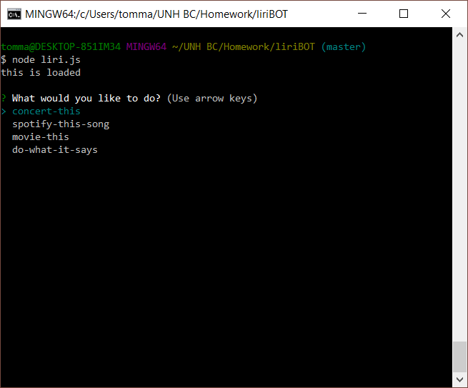
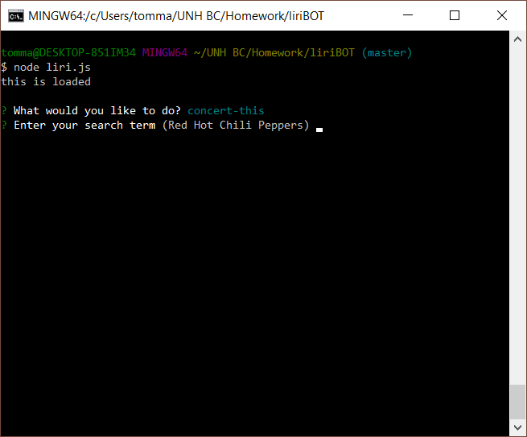
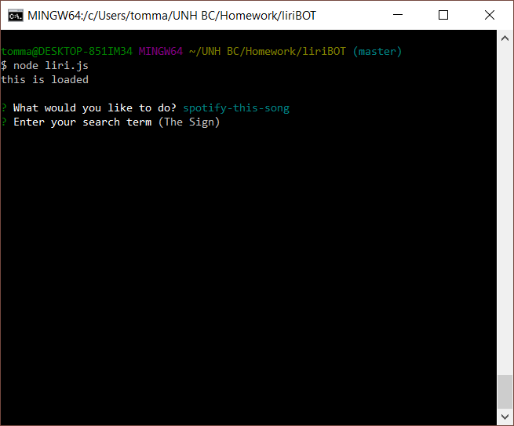
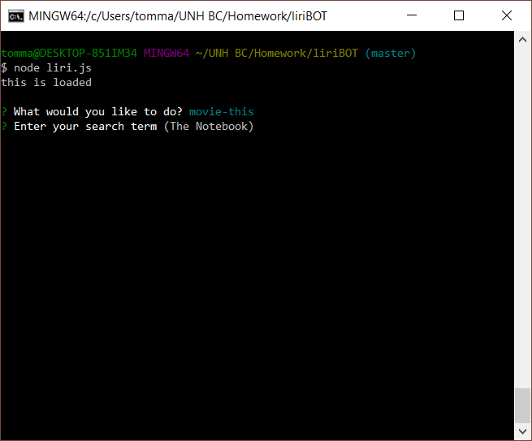
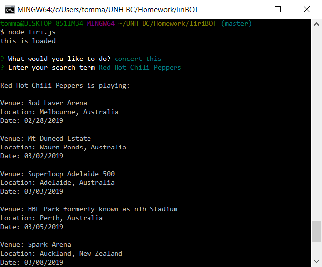
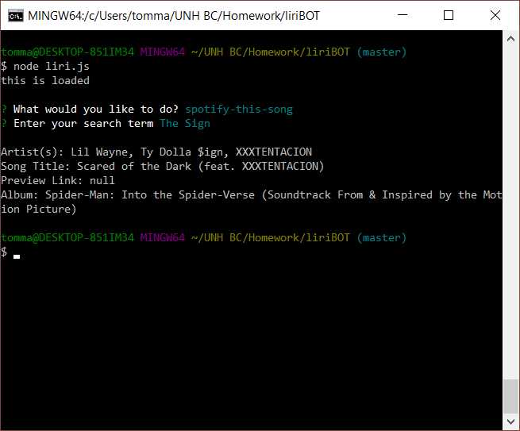
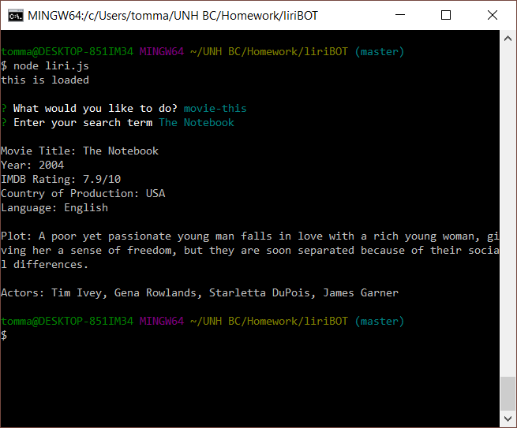
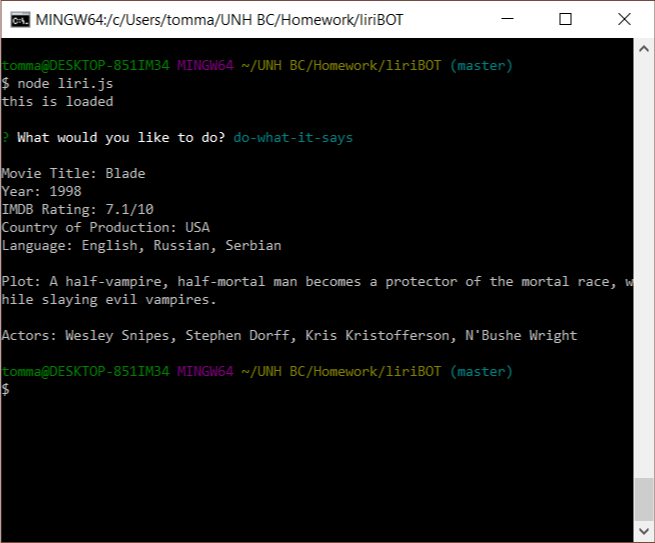

# liriBOT
## A CLI API Fetch Tool

From the command line enter:



The tool will prompt the user to select their intended action.



Selecting an action will trigger another prompt asking the user for their search input.  Each search prompt has a default entry included, excepting do-what-it-says.





*concert-this will return information about a band's upcoming show dates and venues.



*spotify-this-song will return information about the song given by the user: artists, song title, a preview link from Spotify, and the album.



*movie-this will return information about the movie title entered by the user: movie title, year, IMDB Rating, country of production, language, plot, and actors.



*do-what-it-says consumes an argument from a text file in the same directory as the application called "random.txt".  The argument must be formatted as liri-action,"search term".

Example: 
```
movie-this,"Blade"
```



The command used and the results of the search will be added to a log file `log.txt`

